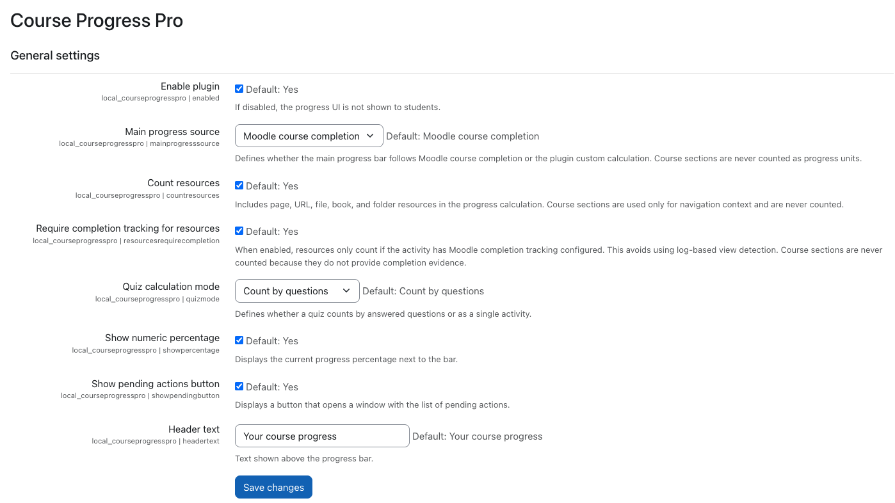
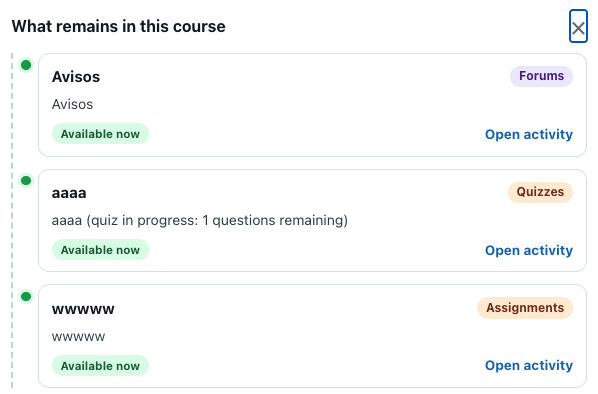
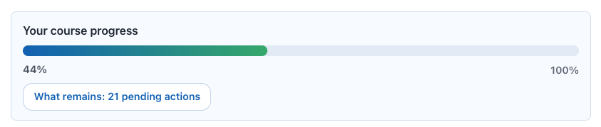

# Course Progress Pro (`local_courseprogresspro`)

Pro edition of Course Progress for Moodle.

Current release: `0.7.25` (`2026031518`)

## Repository

- GitHub: https://github.com/antoniomexdf-boop/moodle-local_courseprogresspro

## Edition Identity

- Repository name: `moodle-local_courseprogresspro`
- Moodle plugin folder: `courseprogresspro`
- Moodle component: `local_courseprogresspro`

## Author and Contact

- Author: Jesus Antonio Jimenez Avina
- Email: antoniomexdf@gmail.com

## Features

- Main progress bar aligned to Moodle course completion by default.
- Pending actions summary.
- Pending actions button.
- Pending timeline/modal with direct activity links.
- Availability and activity-type highlighting in pending list.
- Quiz pending detail shown as one pending action with remaining-question context.
- Completion-aware resource counting mode.
- Course sections are not counted as progress units; they are only used as navigation context or fallback links.
- Optional legacy custom progress mode for compatibility.
- Global enable/disable switch.

## Student Experience

- The main bar reflects official Moodle course progress by default.
- The pending button now carries the "what remains" summary to keep the widget compact.
- Students only see a generic progress UI (no Lite/Pro label).

## Installation

1. Copy folder `courseprogresspro` to `local/courseprogresspro`.
2. Go to `Site administration > Notifications`.
3. Complete upgrade.
4. Purge Moodle caches.

## Documentation

- User manual (EN): `MANUAL_EN.md`
- Changelog: `CHANGELOG.md`

## Language Packs

- The plugin package ships with English strings only, following Moodle plugin directory guidance.
- Additional translations should be contributed through Moodle translation infrastructure after approval.

## Screenshots

## License

GNU GPL v3 or later.
